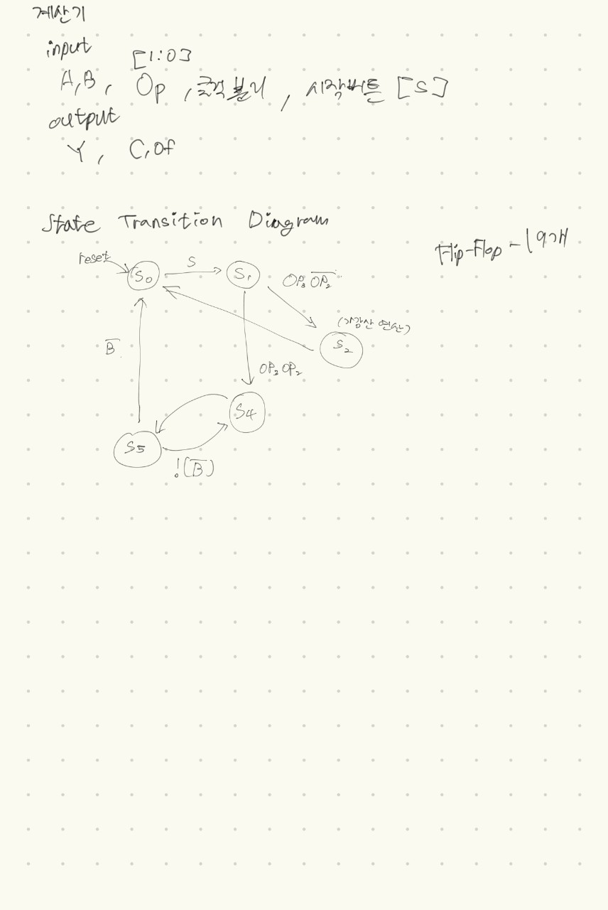

# 계산기
덧셈, 뺄셈, 곱셈, 나눗셈을 할 수 있는 8비트 계산기를 RCA를 통해 만들어 보기! 
MSB는 부호비트로 사용할 수 있게도 없게도 할 예정! 그리고 State 레지스터 존재(음수, 캐리, 오버플로우를 알려주며, FSM의 State와는 다름)
### input
- 들어온 값을 지정하는 FF의 클럭, FSM State의 FF의 클럭 [CLKd, CLKs]
- 8비트 수 입력 두개 [A, B]
- 3비트 연산 셀럭터 (음수지정 포함) [Op]
- 구동 버튼(..) [S]
### output
- 8비트 수 출력 [Y]
- Carry, Overflow State 레지스터 [C, Of]
## State Transition Diagram

