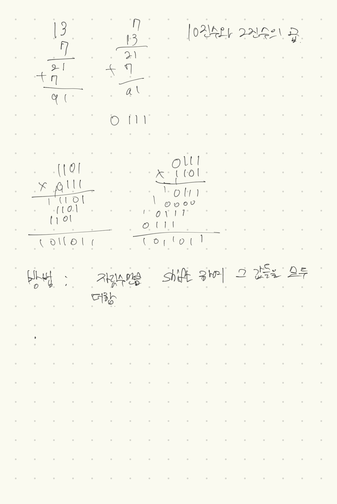
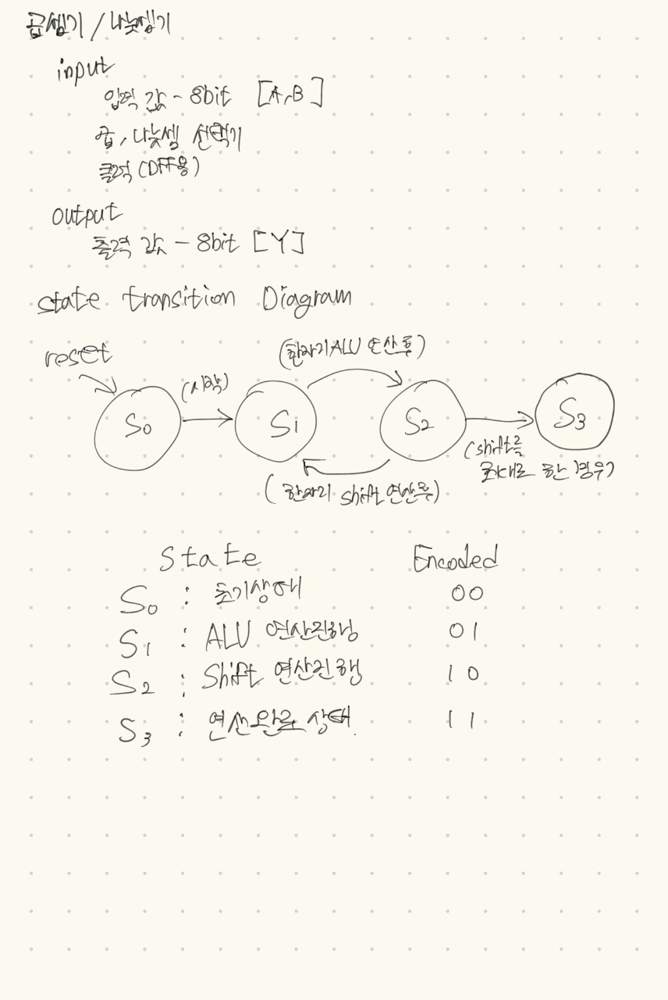

# 곱셈기/나눗셈기
### 목적
FSM 회로로 이진 곱셈기를 직접 구현해 보자. 
여러개의 mux, Flip-Flop과 함께 Shift 회로를 구현하고 곱셈과 나눗셈에 적용해보자

## I/O
### input
8bit 입력 두개 [A, B] 
곱셈, 나눗셈 선택기 
Flip-Flop용 CLK 

### output 
8bit 출력 [Y]

## 최초 문제 해결법 가설 (문제를 보기만 했을 때)
나눗셈기는 곱셈기의 음수 연결로 사용할 예정입니다. 
입력 A, B는 Enable DFF로 구성, ALU 하나와 Shifter 레지스터를 하나씩 배치 
STATE는 초기상태[S0], ALU연산상태[S1], Shift레지스터동작[S2], 완료상태[S3] 로 구성할 예정입니다.

## 이진수에서의 곱

처음에 생각했던 로직으로 동작하게 하면 될 것 같다!

## State Transition Diagram
